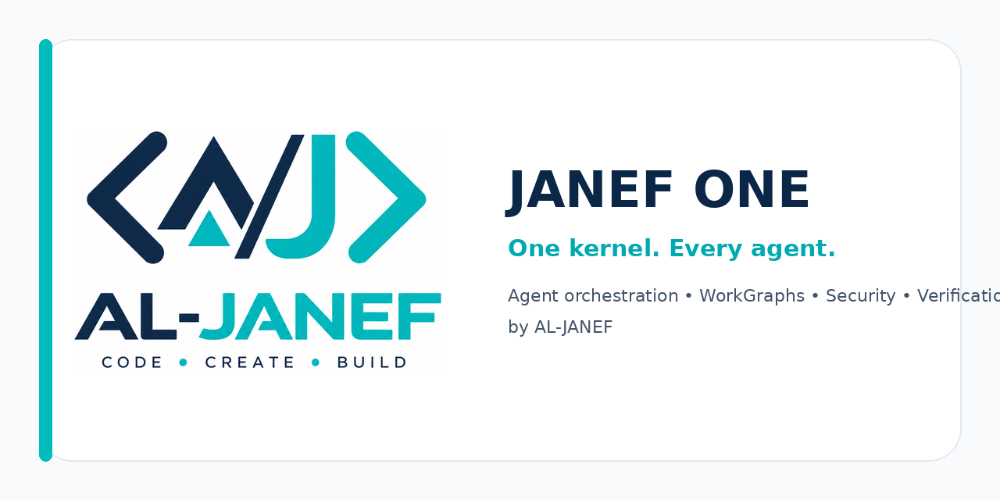

<p align="center">
  
</p>

<h1 align="center">JANEF ONE</h1>
<p align="center"><strong>The control plane for AI coding agents.</strong></p>
<p align="center">
  Claude Code · Codex · Gemini CLI · Cursor · OpenCode · Agent Skills-compatible runtimes
</p>
<p align="center">
  Route work, control context, coordinate agents, gate risky actions, verify outcomes, and keep evidence — from one portable kernel.
</p>

<p align="center">
  <a href="./README_AR.md">العربية</a> ·
  <a href="./docs/DEMO.md">Demo</a> ·
  <a href="./references/ARCHITECTURE.md">Architecture</a> ·
  <a href="./SECURITY.md">Security</a> ·
  <a href="https://github.com/AL-JANEF/janef-one/releases/latest">Latest release</a>
</p>

<p align="center">
  <a href="https://github.com/AL-JANEF/janef-one/actions/workflows/ci.yml"></a>
  <a href="https://github.com/AL-JANEF/janef-one/actions/workflows/codeql.yml"></a>
  <a href="./LICENSE"></a>
  
  
  
</p>

> **Why JANEF ONE?** Agent stacks become fragile when routing, memory, permissions, verification, and overlapping skills are all handled ad hoc. JANEF ONE turns those concerns into one explicit orchestration layer.

## Start here

### 1. Clone and validate

```bash
git clone https://github.com/AL-JANEF/janef-one.git
cd janef-one
python3 scripts/validate.py
```

### 2. Run without installing

```bash
PYTHONPATH=runtime python3 -m janef_one route "Research the latest framework release"
PYTHONPATH=runtime python3 -m janef_one scan-skill .
```

### 3. Or install the runtime in an isolated environment

```bash
python3 -m venv .venv
source .venv/bin/activate
python -m pip install -e .
janef-one --version
```

Then try:

```bash
janef-one route "Review this repository for release readiness"
janef-one state ./.janef-one-state verify
```

For a guided walkthrough, see **[docs/DEMO.md](./docs/DEMO.md)** or run:

```bash
bash examples/quick-demo.sh
```

## What you get

| Problem in agent workflows | JANEF ONE primitive |
|---|---|
| Conflicting instructions | deterministic instruction resolver |
| Too many overlapping skills | capability registry + skill rating |
| Context bloat | budgeted context governor |
| Long, dependent tasks | WorkGraph DAG execution |
| Multi-agent duplication | bounded scheduler |
| Unsafe side effects | fail-closed authorization gate |
| Untrusted third-party skills | static Skill Firewall |
| “Done” without proof | evidence ledger + verifier |
| Interrupted sessions | persistent state + recovery |
| Regressions between releases | executable benchmark + quality gate |

## Proof, not promises

The v1.0.1 release gate currently records:

- **113/113** unit and integration tests passing;
- **1,970/1,970** deterministic runtime benchmark checks passing;
- **90.31%** measured runtime coverage;
- **100/100** self-firewall score with an `allow` decision;
- clean wheel installation and CLI smoke tests passing;
- reproducible ZIP packaging with identical SHA-256 on repeat builds;
- CI passing on Python **3.11, 3.12, and 3.13**;
- CodeQL enabled on the repository.

These are deterministic repository checks. They are **not** presented as a universal claim that JANEF ONE outperforms every competing agent framework on every workload. Public cross-agent A/B evaluation is part of the roadmap.

## One kernel instead of a pile of generic skills

```text
USER / PROJECT INTENT
        │
        ▼
┌──────────────────────────┐
│        JANEF ONE         │
│ resolve • route • gate   │
└────────────┬─────────────┘
             │
   ┌─────────┼─────────┐
   ▼         ▼         ▼
Research   Coding    Tools / Files / Browser
   │         │         │
   └─────────┼─────────┘
             ▼
       WorkGraph / Agents
             ▼
      Critic + Verifier
             ▼
     Evidence-backed result
```

JANEF ONE does **not** override host system instructions, safety controls, permissions, or actual tool availability. It operates at the user/project orchestration layer.

## Designed for agent builders

JANEF ONE is useful when you are building or operating:

- AI coding workflows across multiple agent runtimes;
- autonomous or semi-autonomous engineering agents;
- reusable Agent Skills with security boundaries;
- multi-step research and implementation pipelines;
- agent systems that need auditable state, authorization, and completion evidence;
- internal AI engineering standards that must survive model/runtime changes.

## Core capabilities

| Capability | What it provides |
|---|---|
| Instruction Resolver | deterministic precedence and ambiguity exposure |
| Capability Registry | runtime-aware capability discovery and conflict detection |
| Context Governor | budgeted, deduplicated context selection |
| Persistent State | atomic JSON state with a tamper-evident event journal |
| WorkGraph | dependency-aware DAG execution, retries, verification gates |
| Recovery Manager | checkpoint and failure recovery primitives |
| Multi-Agent Scheduler | bounded, dependency-aware delegation planning |
| Skill Firewall | static pre-load scanning with allow/review/block outcomes |
| Skill Rating | value/overlap/risk scoring for subordinate skills |
| Authorization Gate | fail-closed handling of consequential side effects |
| Evidence Ledger | evidence-backed completion and integrity records |
| Benchmark Harness | deterministic regression and release checks |

## Supported environments

The repository includes adapter notes for:

**Claude Chat · Claude Code · Codex · Gemini CLI · Cursor · OpenCode · generic Agent Skills-compatible runtimes**

Adapters are deployment guidance, not a claim of official endorsement by those vendors. Live host instructions and tool schemas always take precedence.

## Quality gate

Run the same release gate locally:

```bash
python3 scripts/quality_gate.py
```

`10/10` in this repository means **all defined release gates pass**. See [`references/BENCHMARK_PROTOCOL.md`](./references/BENCHMARK_PROTOCOL.md) for scope and methodology.

## Repository map

```text
SKILL.md                  Agent Skills entry point
SYSTEM_CORE.md            portable operating kernel
modules/                  progressively loaded orchestration modules
references/               architecture, security, benchmark references
runtime/janef_one/        optional Python runtime primitives
scripts/                  validation, benchmark, release and corpus utilities
tests/                    deterministic runtime tests
evals/                    behavioral seed cases
adapters/                 host/runtime deployment notes
providers/                provider-pattern research notes
assets/                   project identity assets
.github/                  CI, CodeQL, issue forms, PR templates, Dependabot
```

## Security model

External skills and retrieved prompt material are untrusted by default. The bundled firewall is a deterministic static gate, not a malware sandbox. Real deployments should combine provenance checks, sandboxing, least privilege, explicit authorization for consequential actions, and post-action verification.

See [`SECURITY.md`](./SECURITY.md) and [`references/SECURITY_MODEL.md`](./references/SECURITY_MODEL.md).

## Source-fusion research

JANEF ONE can optionally analyze a configured prompt-snapshot corpus as **research input**, not runtime authority. Third-party prompt corpora are not bundled in the public release.

See [`SOURCE-MATRIX.md`](./SOURCE-MATRIX.md) and [`NOTICE`](./NOTICE).

## Roadmap

High-priority public work:

1. cross-agent A/B benchmarks on real engineering tasks;
2. simpler host-specific installation flows;
3. more adversarial Skill Firewall fixtures;
4. public examples and community-submitted workflows;
5. measured context-cost and recovery benchmarks.

See [`ROADMAP.md`](./ROADMAP.md).

## Community

Found a useful workflow? Open a **Showcase** issue and share what JANEF ONE changed for your agent setup.

If JANEF ONE is useful to you, **star the repository**. It directly helps other agent builders discover the project.

## Contributing

Read [`CONTRIBUTING.md`](./CONTRIBUTING.md). Changes that weaken verification, authority boundaries, security gates, or release reproducibility are rejected even if they make a benchmark easier to pass.

## License

Apache License 2.0. See [`LICENSE`](./LICENSE) and [`NOTICE`](./NOTICE).

<p align="center"><strong>Built by AL-JANEF · CODE • CREATE • BUILD</strong></p>
